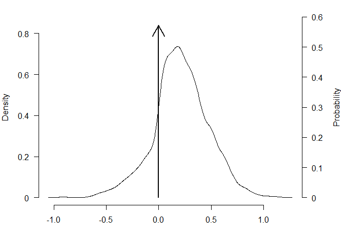
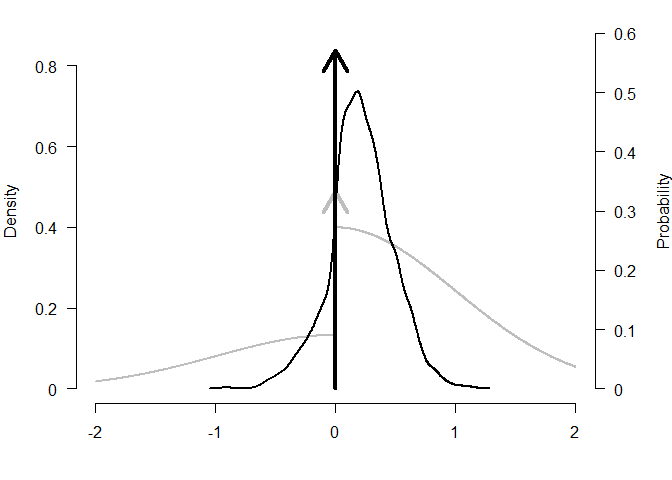
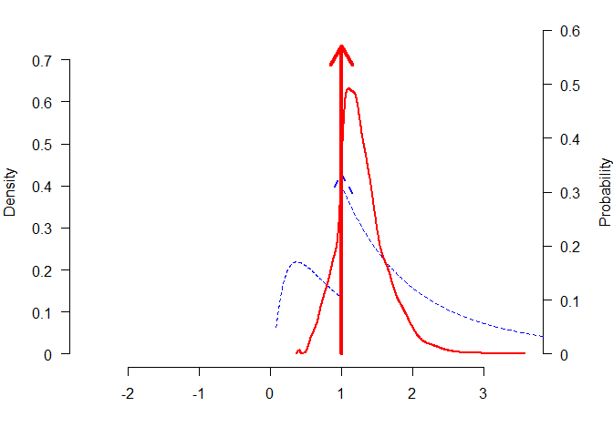
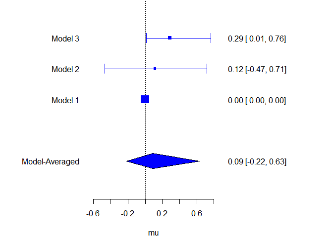
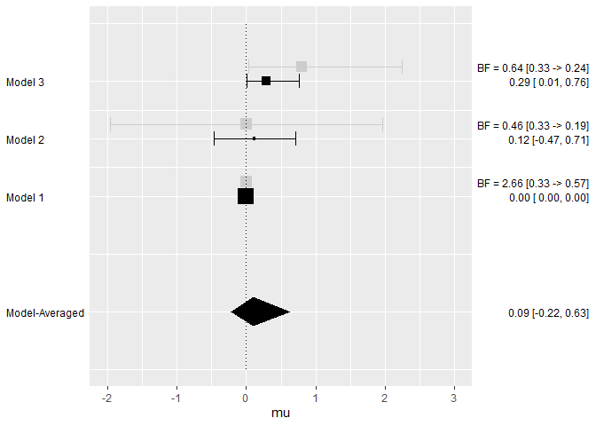

<!-- README.md is generated from README.Rmd. Please edit that file -->

# BayesTools

<!-- badges: start -->

[](https://codecov.io/gh/FBartos/BayesTools?branch=master)
[](https://github.com/FBartos/BayesTools/actions)
<!-- badges: end -->

The goal of BayesTools is to provide functions that simplify building R
packages focused on Bayesian inference and Bayesian model-averaging.

Currently, the package provides several tools:

-   prior distribution (with S3 methods for plot/print/pdf/cdf/rng/…)
-   JAGS models automation (generating JAGS model syntax and
    `bridgesampling` marginal likelihood functions for prior
    distributions, various wrappers, …)
-   model-averaging (mixing posterior distributions, computing Bayes
    factors, generating summary tables, …)

## Installation

You can install the released version of BayesTools from
[CRAN](https://CRAN.R-project.org) with:

``` r
install.packages("BayesTools")
```

And the development version from [GitHub](https://github.com/) with:

``` r
# install.packages("devtools")
devtools::install_github("FBartos/BayesTools")
```

## Prior Distributions

Prior distribution can be created with the `prior` function.

``` r
library(BayesTools)
#> Loading required namespace: runjags
#> 
#> Attaching package: 'BayesTools'
#> The following objects are masked from 'package:stats':
#> 
#>     sd, var
#> The following object is masked from 'package:grDevices':
#> 
#>     pdf

p0 <- prior(distribution = "point",  parameters = list(location = 0))
p1 <- prior(distribution = "normal", parameters = list(mean = 0, sd = 1))
p2 <- prior(distribution = "normal", parameters = list(mean = 0, sd = 1), truncation = list(0, Inf))
```

The priors can be easily visualized with many possible arguments

``` r
plot(p0)
```


``` r
plot(p1, lwd = 2, col = "blue", par_name = bquote(mu))
```


``` r
plot(p2, plot_type = "ggplot")
#> Loading required namespace: ggplot2
```


``` r
plot(p2, plot_type = "ggplot", xlim = c(-2, 2)) + geom_prior(p1, col = "red", lty = 2)
```


``` r
plot(p1, transformation = "exp")
```


All priors also contain some basic S3 methods.

``` r
# S3 methods
rng(p0, 10)
#>  [1] 0 0 0 0 0 0 0 0 0 0
rng(p1, 10)
#>  [1]  1.02699572 -0.73820666  0.07436014 -0.02770086 -0.14089681  1.02966330
#>  [7] -0.68667265 -0.14574682  0.02461917  0.19182737
rng(p2, 10)
#>  [1] 1.4366299 1.4879276 0.1887744 0.3369953 0.7749108 0.1611865 0.1596650
#>  [8] 0.6664159 0.1904750 1.3669017

pdf(p0, c(-1, 0, 1))
#> [1]   0 Inf   0
pdf(p1, c(-1, 0, 1))
#> [1] 0.2419707 0.3989423 0.2419707
pdf(p2, c(-1, 0, 1))
#> [1] 0.0000000 0.7978846 0.4839414

cdf(p0, c(-1, 0, 1))
#> [1] 0 1 1
cdf(p1, c(-1, 0, 1))
#> [1] 0.1586553 0.5000000 0.8413447
cdf(p2, c(-1, 0, 1))
#> [1] 0.0000000 0.0000000 0.6826895

mean(p0)
#> [1] 0
mean(p1)
#> [1] 0
mean(p2)
#> [1] 0.7978846

sd(p0)
#> [1] 0
sd(p1)
#> [1] 1
sd(p2)
#> [1] 0.6028103

print(p0)
#> Spike(0)
print(p1, short_name = TRUE)
#> N(0, 1)
```

## JAGS Automation

The packages simplifies development of JAGS models by automatically
taking care of the prior distributions relevant portion of the code.

First, we generate few samples from a normal distribution and use the
previously specified prior distributions as priors for the mean (passed
with a list).

``` r
# get some data
set.seed(1)
data <- list(
  x = rnorm(10),
  N = 10
)
data$x
#>  [1] -0.6264538  0.1836433 -0.8356286  1.5952808  0.3295078 -0.8204684
#>  [7]  0.4874291  0.7383247  0.5757814 -0.3053884

## create and fit models
# define priors
priors_list0 <- list(mu = p0)
priors_list1 <- list(mu = p1)
priors_list2 <- list(mu = p2)
```

We create a `model_syntax` that defines likelihood of the data for the
JAGs model and fit the models with the `JAGS_fit` wrapper that
automatically adds prior distributions to the syntax, generates starting
values, creates list of monitored variables, and contains additional
control options (most of the functionality is build upon `runjags`
package).

``` r
# define likelihood for the data
model_syntax <-
  "model{
    for(i in 1:N){
      x[i] ~ dnorm(mu, 1)
    }
  }"

# fit the models
fit0 <- JAGS_fit(model_syntax, data, priors_list0, seed = 0)
#> Loading required namespace: rjags
fit1 <- JAGS_fit(model_syntax, data, priors_list1, seed = 1)
fit2 <- JAGS_fit(model_syntax, data, priors_list2, seed = 2)
```

The `runjags_estimates_table` function then provides a nicely formated
summary for the fitted model.

``` r
# formatted summary tables
runjags_estimates_table(fit1, priors_list1)
#>     Mean    SD    lCI Median   uCI error(MCMC) SD/error(MCMC)   ESS R-hat
#> mu 0.116 0.304 -0.469  0.117 0.715     0.00242          0.008 15748 1.000
```

We create a `log_posterior` function that defines the log likelihood of
the data for marginal likelihood estimation via `bridgesampling` (while
creating a dummy bridge sampling object for the model without any
posterior samples).

``` r
# define log posterior for bridge sampling
log_posterior <- function(parameters, data){
  sum(dnorm(data$x, parameters$mu, 1, log = TRUE))
}

# get marginal likelihoods
marglik0 <- list(
  logml = sum(dnorm(data$x, mean(p0), 1, log = TRUE))
)
class(marglik0) <- "bridge"
marglik1 <- JAGS_bridgesampling(fit1, data, priors_list1, log_posterior)
marglik2 <- JAGS_bridgesampling(fit2, data, priors_list2, log_posterior)

marglik1
#> Bridge sampling estimate of the log marginal likelihood: -13.1383
#> Estimate obtained in 4 iteration(s) via method "normal".
```

## Model-Averaging

The package also simplifies implementation of Bayesian model-averaging
(see e.g., `RoBMA` package).

First, we create a list of model objects, each containing the JAGS fit,
marginal likelihood, list of prior distribution, prior weights, and
generated model summaries. Then we apply the `models_inference`
automatically calculating basic model-averaging information. Finally, we
can use `model_summary_table` to summarize the individual models.

``` r
## create an object with the models
models <- list(
  list(fit = fit0, marglik = marglik0, priors = priors_list0, prior_weights = 1, fit_summary = runjags_estimates_table(fit0, priors_list0)),
  list(fit = fit1, marglik = marglik1, priors = priors_list1, prior_weights = 1, fit_summary = runjags_estimates_table(fit1, priors_list1)),
  list(fit = fit2, marglik = marglik2, priors = priors_list2, prior_weights = 1, fit_summary = runjags_estimates_table(fit2, priors_list2))
)
# compare and summarize the models
models <- models_inference(models)

# create model-summaries
model_summary_table(models[[1]])
#>                                                                 
#>  Model               1             Parameter prior distributions
#>  Prior prob.     0.333                                          
#>  log(marglik)   -12.02                                          
#>  Post. prob.     0.570                                          
#>  Inclusion BF    2.655
model_summary_table(models[[2]])
#>                                                                 
#>  Model               2             Parameter prior distributions
#>  Prior prob.     0.333                         mu ~ Normal(0, 1)
#>  log(marglik)   -13.14                                          
#>  Post. prob.     0.186                                          
#>  Inclusion BF    0.458
model_summary_table(models[[3]])
#>                                                                 
#>  Model               3             Parameter prior distributions
#>  Prior prob.     0.333                 mu ~ Normal(0, 1)[0, Inf]
#>  log(marglik)   -12.87                                          
#>  Post. prob.     0.243                                          
#>  Inclusion BF    0.644
```

Moreover, we can draw inference based on the whole ensemble for the
common parameters with the `ensemble_inference` function, or mixed the
posterior distributions based on marginal likelihoods with the
`mix_posteriors` functions. The various summary functions then create
tables for the inference, estimates, model summary, and MCMC
diagnostics.

``` r
## draw model based inference
inference          <- ensemble_inference(model_list = models, parameters = "mu", is_null_list = list("mu" = 1))

# automatically mix posteriors
mixed_posteriors   <- mix_posteriors(model_list = models, parameters = "mu", is_null_list = list("mu" = 1), seed = 1)

# summarizes the model-averaging summary
ensemble_inference_table(inference, parameters = "mu")
#>    Models Prior prob. Post. prob. Inclusion BF
#> mu    2/3       0.667       0.430        0.377
ensemble_estimates_table(mixed_posteriors,  parameters = "mu")
#>     Mean Median  0.025  0.95
#> mu 0.091  0.000 -0.218 0.523
ensemble_summary_table(models, parameters = "mu")
#>  Model       Prior mu       Prior prob. log(marglik) Post. prob. Inclusion BF
#>      1                            0.333       -12.02       0.570        2.655
#>      2         Normal(0, 1)       0.333       -13.14       0.186        0.458
#>      3 Normal(0, 1)[0, Inf]       0.333       -12.87       0.243        0.644
ensemble_diagnostics_table(models, parameters = "mu", remove_spike_0 = FALSE)
#>  Model       Prior mu       max[error(MCMC)] max[SD/error(MCMC)] min(ESS)
#>      1             Spike(0)               NA                  NA       NA
#>      2         Normal(0, 1)          0.00242               0.008    15748
#>      3 Normal(0, 1)[0, Inf]          0.00162               0.008    16078
#>  max(R-hat)
#>          NA
#>       1.000
#>       1.000
```

The packages also provides functions for plotting model-averaged
posterior distributions.

``` r
### plotting
# plot model-average posteriors
par(mar = c(4, 4, 1, 4))
plot_posterior(mixed_posteriors, parameter = "mu")
```



``` r
plot_posterior(mixed_posteriors, parameter = "mu", lwd = 2, col = "black", prior = TRUE, dots_prior = list(col = "grey", lwd = 2), xlim = c(-2, 2))
```



``` r
plot_posterior(mixed_posteriors, parameter = "mu", transformation = "exp", lwd = 2, col = "red", prior = TRUE, dots_prior = list(col = "blue", lty = 2))
```



Or comparing estimates from the different models.

``` r
plot_models(model_list = models, samples = mixed_posteriors, inference = inference, parameter = "mu", col = "blue")
```



``` r
plot_models(model_list = models, samples = mixed_posteriors, inference = inference, parameter = "mu", prior = TRUE, plot_type = "ggplot")
```


